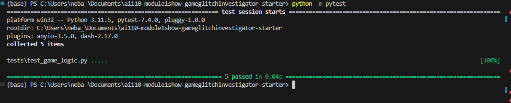

# 🎮 Game Glitch Investigator: The Impossible Guesser

## 🚨 The Situation

You asked an AI to build a simple "Number Guessing Game" using Streamlit.
It wrote the code, ran away, and now the game is unplayable. 

- You can't win.
- The hints lie to you.
- The secret number seems to have commitment issues.

## 🛠️ Setup

1. Install dependencies: `pip install -r requirements.txt`
2. Run the broken app: `python -m streamlit run app.py`

## 🕵️‍♂️ Your Mission

1. **Play the game.** Open the "Developer Debug Info" tab in the app to see the secret number. Try to win.
2. **Find the State Bug.** Why does the secret number change every time you click "Submit"? Ask ChatGPT: *"How do I keep a variable from resetting in Streamlit when I click a button?"*
3. **Fix the Logic.** The hints ("Higher/Lower") are wrong. Fix them.
4. **Refactor & Test.** - Move the logic into `logic_utils.py`.
   - Run `pytest` in your terminal.
   - Keep fixing until all tests pass!

## 📝 Document Your Experience

- **the game's purpose.**
   This is a number guessing game where the program generates a secret number and you have to guess it within a limited number of attempts. After each guess you get a hint telling you to go higher or lower. You can choose between three difficulty levels — Easy, Normal, and Hard — each with a different number range and attempt limit. The game also tracks your score based on how quickly you find the secret number.

**Bugs Fixed:**

The New Game button did not fully reset the game after winning or losing — status, score, and history were not clearing properly
The number range shown to the player was hardcoded to 1–100 regardless of difficulty — it now correctly updates to match Easy (1–20), Normal (1–100), and Hard (1–50)
The hints were reversed — guessing too high told you to go higher instead of lower, making the game impossible to win fairly

**how it was fixed**
Bug 3 — Reversed hints
The check_guess function was returning "Go HIGHER" when the guess was too high and "Go LOWER" when it was too low. Fixed the display logic in app.py so hints now correctly direct the player in the right direction.
Bug 4 — New Game button not fully resetting
The original button only reset attempts and secret. Fixed it to also reset score, status, and history, and replaced the hardcoded random.randint(1, 100) with random.randint(low, high) so the new secret respects the current difficulty.
Bug 1 — Secret not resetting on difficulty change
Added a difficulty detection block that compares the current difficulty to the previously stored one. When they differ, the entire game state resets and a new secret is generated within the correct range.
Bug 8 — Info message hardcoded range
Changed "Guess a number between 1 and 100" to f"Guess a number between {low} and {high}" so the player always sees the correct range for their chosen difficulty.

## 📸 Demo

- [ ] [Insert a screenshot of your fixed, winning game here]

## 🚀 Stretch Features

- [ ] [If you choose to complete Challenge 4, insert a screenshot of your Enhanced Game UI here]
